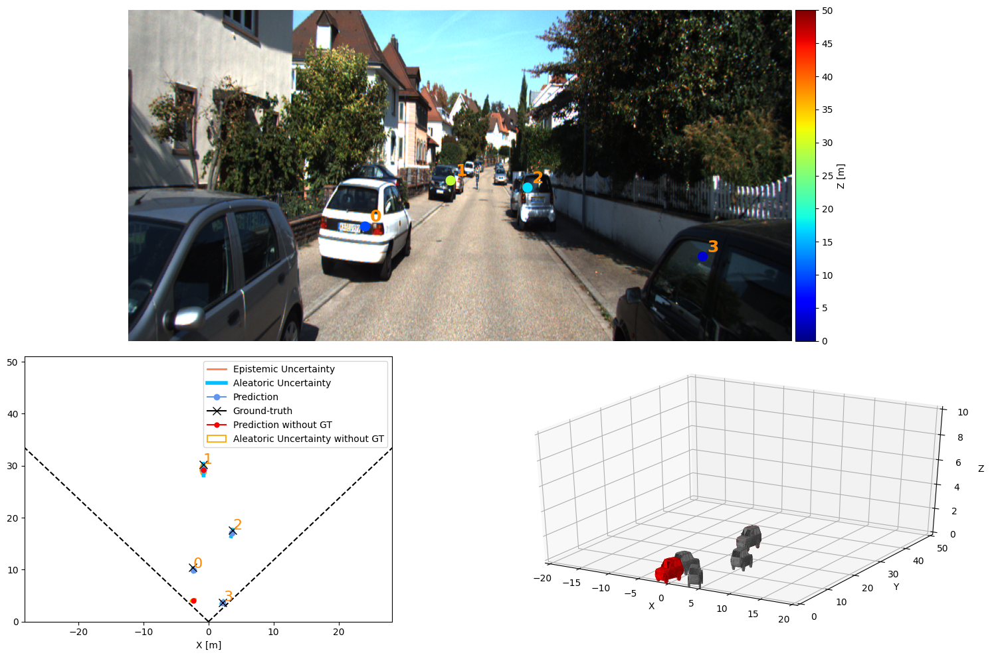
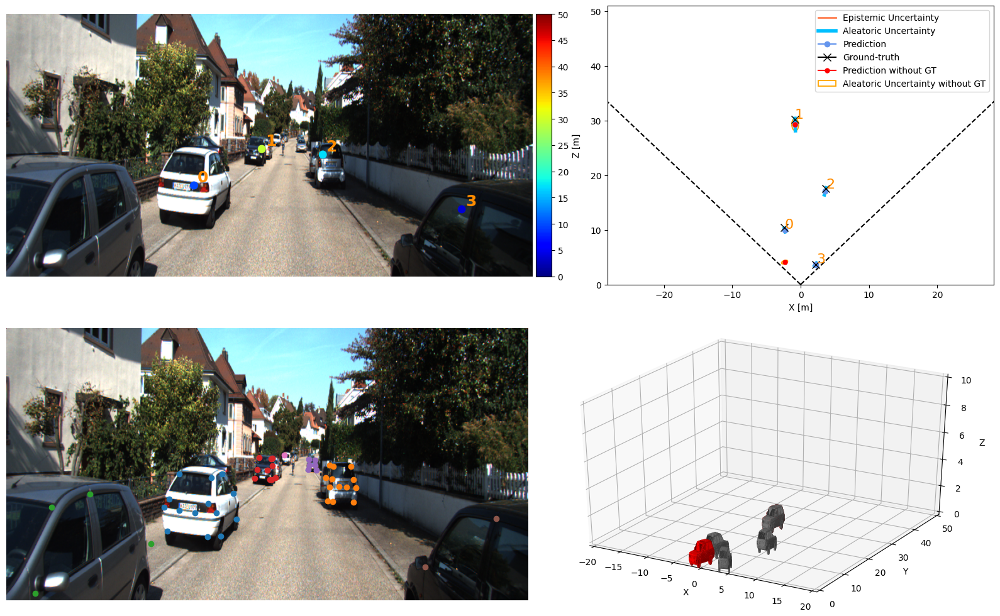

# Semester Project :  3D vehicle detection from a single monocular image

This github repository is the result of a semester project performed in the [VITA laboratory](https://www.epfl.ch/labs/vita/) at EPFL during the second semester of 2023. The goal of this semester was to implement a keypoint based vehicle detection and ditance estimation. To do so, 2 previous work performed by the laboratory were used: the [Openpifpaf algorithm](https://github.com/vita-epfl/openpifpaf) for the keypoint detection and the [Monoloco algorithm](https://github.com/vita-epfl/monoloco) for the distance estimation.


## Vehicles


To call the functions while working with vehicles, simply add ```--vehicles``` at the end of your command such as in :

```python3 -m monstereo.run prep --dir_ann /Users/samiferchiou/VITA/monstereo/data/kitti-pifpaf/annotations_car --monocular --vehicles --dataset kitti --transformer```

This is true for every regular commands that you are using monstereo with (predict, train, ...).

## Self-attention usage

Self-attention is used to improve the performances when the model is faced with severely occluded instances. The objective was to use self-attention to deduce the impact of the occluded keypoitns by deducting them from the non-occluded ones. This techniques yields better results than the previous monoloco baseline for vehicles.

To use the self-attention mechanism, the tag ```--transformer``` needs to be added at the end of your command such as in :

```python3 -m monstereo.run train --epochs 50 --lr 0.001 --joints /Users/samiferchiou/VITA/monstereo/data/arrays/joints-kitti-vehicles-transformer-230501-115137.json --monocular --vehicles --dataset kitti --save --transformer```


This is true for every regular commands that you are using monstereo with (predict, train, ...).


## Visualization options

For the prediction step, several new visualization are now available for the vehicle case. Those options are enabled by changing the parameter ```--output_types```.

An example of each visualization is given below :


```--output_types combined_kps```:


```--output_types combined_nkps```:



```--output_types combined_3d```:


